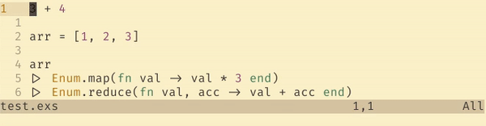

# The Red Pill

In 1999's The Matrix, Morpheus presents the protagonist Neo with two options:
- Take the blue pill and keep living his life into ignorance.
- Take the red pill and see the truth about the world.

This is what I am offering you here.
You can either keep writing your code as you always did or take the red pill and see beyond the words you are typing in your editor.
Reach to the truth about your code. Watch it run while you write it.

## Installation
TODO

## How to use it?
- Mark those lines you want to see the result with a `#=>` in the end
- Run the script `red_pill <file_name>`
  - You can use your editor's functionality to replace the current file with the output

### Example

## What I envision for the future of the project
- [ ] Create plugins for easy usage on text editors
- [ ] Support for modules
- [ ] Support for functions
- [ ] Support for compiled code, not only scripts
- [ ] Support for projects
- [ ] Some way to pass the lines to be annotated without an actual annotation
- [ ] Bug fixes, obviously
